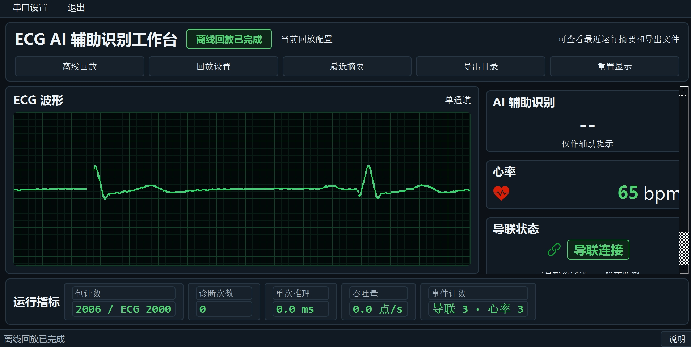

# ECG AI 辅助识别上位机 Demo

[](https://www.python.org/)
[](https://riverbankcomputing.com/software/pyqt/)
[](https://pytorch.org/)
[](LICENSE)

一个基于 PyQt5 和 TorchScript 的 ECG 辅助识别实验系统。当前版本聚焦部署侧 Demo 闭环：固定样例 ECG 离线回放、波形展示、心率/导联事件、模型辅助识别、运行指标和可追溯导出。

> 说明：本项目输出只作为辅助提示和实验验证，不是临床独立诊断产品。



## 快速开始

推荐环境：

- Windows 10/11
- Python 3.10+
- PowerShell

安装依赖：

```powershell
python -m pip install -r requirements.txt
```

一键启动固定 Demo：

```powershell
.\run_demo.ps1
```

也可以双击：

```text
run_demo.bat
```

脚本会从仓库根目录自动定位 `*pyqt\ECGMonitor\main.py`，并启动：

```powershell
python 模型部署pyqt\ECGMonitor\main.py --demo
```

启动后会自动进入固定离线回放场景，无需手动选择样例数据。

## Demo 展示内容

- 中央 ECG 波形主视图区。
- 右侧 AI 辅助识别、心率、三导联单通道导联状态。
- 底部运行指标：包计数、诊断次数、单次推理耗时、吞吐量和事件计数。
- 顶部操作入口：离线回放、回放设置、最近摘要、导出目录、重置显示。

## 验证 Demo

维护者可从仓库根目录运行：

```powershell
powershell -ExecutionPolicy Bypass -File .\run_demo_checks.ps1
```

该命令会依次检查：

- 部署侧单元测试
- 固定 demo policy
- 固定场景 mock 回放
- 固定场景真实模型回放

真实模型 smoke 的最低成功标准是输出 `Diagnosis count: 1`。这只证明部署推理链路可用，不代表医学准确率达标。

## 打包 Demo

如需重新构建 exe，先安装 PyInstaller：

```powershell
python -m pip install pyinstaller
```

然后执行：

```powershell
cd 模型部署pyqt\ECGMonitor
python -m PyInstaller main.spec
```

## 核心亮点

- 一键 Demo：`run_demo.ps1` / `run_demo.bat` 固定工作目录并启动 `python main.py --demo`。
- 固定场景：`sample_data/test.csv` 第 4 行、2000 点窗口、稳定心率/导联事件。
- 模型契约：`best_acc.contract.json` 管理输入窗口、归一化参数和 12 分类标签顺序。
- 管线复用：CLI 回放、GUI 回放和串口 worker 共用 `EcgProcessingPipeline`。
- 可追溯导出：每次运行导出 `metrics.jsonl`、`diagnosis.csv`、`ecg_replay.csv`。
- 中文路径兼容：模型加载走二进制内存流，一键脚本避免硬编码中文目录字面量。

## 常用入口

启动普通 GUI：

```powershell
cd 模型部署pyqt\ECGMonitor
python main.py
```

固定场景真实模型回放：

```powershell
python 模型部署pyqt\ECGMonitor\offline_replay.py --row 3 --samples 2000 --event-interval 500 --lead-events 0,0,0,0 --hr-events 72,84,78,90 --real-model
```

固定场景 mock 回放：

```powershell
python 模型部署pyqt\ECGMonitor\offline_replay.py --row 3 --samples 2000 --event-interval 500 --lead-events 0,0,0,0 --hr-events 72,84,78,90 --mock-label 0
```

## 项目结构

```text
模型训练/ECG/
  训练数据处理、模型定义、训练、评估和模型导出

模型部署pyqt/ECGMonitor/
  PyQt 上位机、串口采集、推理、离线回放、导出和测试

docs/
  PRD、技术设计、Demo runbook、模型契约、架构说明和截图资产
```

更多细节见：

- [架构总览](docs/ARCHITECTURE_OVERVIEW.md)
- [Demo 运行手册](docs/DEMO_RUNBOOK.md)
- [数据与模型说明](docs/DATA_AND_MODEL_NOTICE.md)
- [公开仓库发布边界](docs/PUBLICATION_BOUNDARY.md)
- [产品需求](docs/PRD.md)
- [技术设计](docs/TECH_DESIGN.md)
- [模型契约](docs/MODEL_CONTRACT.md)
- [Agent 开发指南](docs/AGENT.md)

## 公开仓库边界

公开仓库保留一键 Demo 所需代码、文档、小体积样例数据和默认部署模型。完整原始数据、完整训练 CSV、训练 checkpoint、历史模型归档和运行输出不纳入公开发布分支。

发布边界详见 [公开仓库发布边界](docs/PUBLICATION_BOUNDARY.md)，数据与模型边界详见 [数据与模型说明](docs/DATA_AND_MODEL_NOTICE.md)。

## 设计边界

1. 本项目定位为 ECG 辅助识别实验系统，重点验证部署闭环，不作为临床独立诊断产品。
2. 一键 Demo 使用固定样例回放，展示波形、心率、导联、辅助识别和运行指标同步更新。
3. 部署侧通过模型契约读取窗口长度、归一化参数和标签顺序，避免模型语义漂移。
4. CLI 回放、GUI 回放和串口输入最终进入同一条 ECG 处理管线，减少行为分叉。
5. 运行后导出 metrics、diagnosis 和 replay 文件，方便复盘本次演示结果。
6. 模型效果、真实临床数据、医生复核、权限审计和医院系统接入仍属于后续方向。
