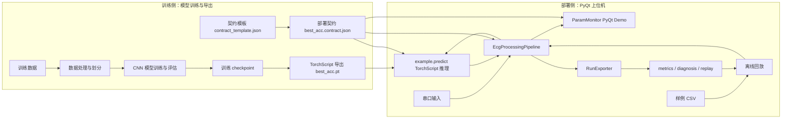

# 架构总览

本文档提供当前项目的公开架构图和模块关系说明。详细设计见 `docs/TECH_DESIGN.md`，模型契约见 `docs/MODEL_CONTRACT.md`。

## 1. 当前定位

当前项目是桌面端 ECG 辅助识别实验系统，公开展示主线是训练侧到部署侧的闭环：

```text
训练数据 -> 模型训练 -> TorchScript 导出 -> 模型契约 -> 部署推理 -> ECG 处理管线 -> GUI Demo
```

V1 不引入独立后端服务和数据库，不承诺临床独立诊断能力。

## 2. 架构图



## 3. 依赖方向

- 训练侧通过模型文件和契约交付给部署侧。
- 部署侧不反向依赖训练脚本。
- GUI 只负责展示、调度和用户入口，不直接承担协议解析、推理细节或导出格式。
- 串口 worker、GUI 回放和 CLI 回放都进入同一条 `EcgProcessingPipeline`。
- 模型输入窗口、归一化参数和标签顺序来自 `best_acc.contract.json`，不在 UI 中重复定义。

## 4. 核心模块边界

| 模块 | 职责 | 不负责 |
| --- | --- | --- |
| `ParamMonitor.py` | 主窗口协调、UI 状态、串口/回放入口、运行摘要展示。 | 模型加载、协议解析核心逻辑、训练流程。 |
| `serial_worker.py` | 串口打开、读取、解包、线程退出和 Qt 信号转发。 | 离线回放数据读取、GUI 布局。 |
| `ecg_pipeline.py` | ECG 窗口累计、推理触发、导联/心率事件处理、metrics 更新。 | 串口生命周期、文件导出、UI 控件操作。 |
| `example.py` | TorchScript 模型加载、输入归一化、分类推理。 | 标签展示规则、训练过程。 |
| `model_contract.py` | 模型契约加载、字段校验、模型路径解析。 | 推理执行、UI 展示。 |
| `offline_replay.py` / `offline_replay_worker.py` | CLI/GUI 离线回放入口和节奏控制。 | 复用串口 worker 私有方法。 |
| `run_exporter.py` | 指标、诊断事件和可回放 ECG 文件导出。 | 推理和 UI 展示。 |

## 5. 当前验证闭环

```text
run_demo_checks.ps1
-> 单元测试
-> demo policy 校验
-> mock 离线回放
-> 真实模型离线回放
```

这条链路用于保护公开 Demo 的可运行性。它证明的是部署链路可用，不证明医学准确率。

## 6. 长期一致性原则

- 新功能优先复用现有管线和契约，不把逻辑塞回主窗口。
- 替换模型必须同步更新契约。
- 离线回放不得调用 `SerialInferenceWorker` 的私有处理方法。
- 公开仓库只保留可运行 Demo 的必要小体积资产。
- 文档描述当前事实和明确边界，不把未来能力写成已实现能力。
